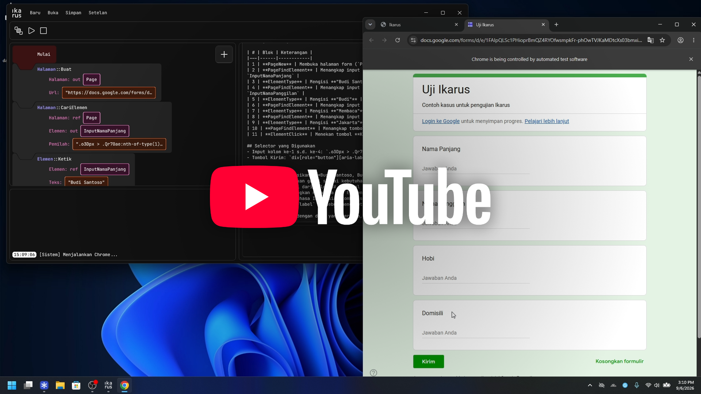

<h1 align="center">
  
</h1>

  

Ikarus adalah perangkat lunak otomasi browser melalui bahasa pemrograman visual.
Ditujukan untuk berusaha mereduksi kewajiban sintaksis dalam memanipulasi DOM.

Dikembangkan dalam rangka penyelesaian skripsi untuk meraih gelar Sarjana Teknik
Informatika di Institut Sains dan Teknologi Nasional.

## Membangun

Untuk membangun Ikarus, diasumsikan lingkungan yang memuat perangkat pembangun
Flutter dan Rust.

1. Gunakan FRB dengan `cargo install flutter_rust_bridge_codegen --version 2.12.0`.
2. Bangun jembatan FFI dengan `flutter_rust_bridge_codegen generate`.
3. Bangun Flutter dengan `flutter build windows --release`.

## YouTube

  

## Lisensi

Kode sumber didistribusikan di bawah lisensi Mozilla Public License 2.0
(MPL-2.0), yang mengizinkan penggunaan, modifikasi, dan distribusi ulang kode
dengan ketentuan bahwa perubahan pada berkas yang berlisensi MPL-2.0 tetap
harus dipublikasikan di bawah lisensi yang sama.
